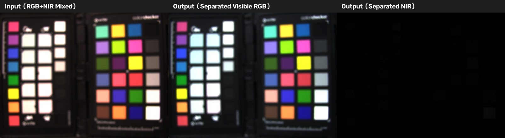
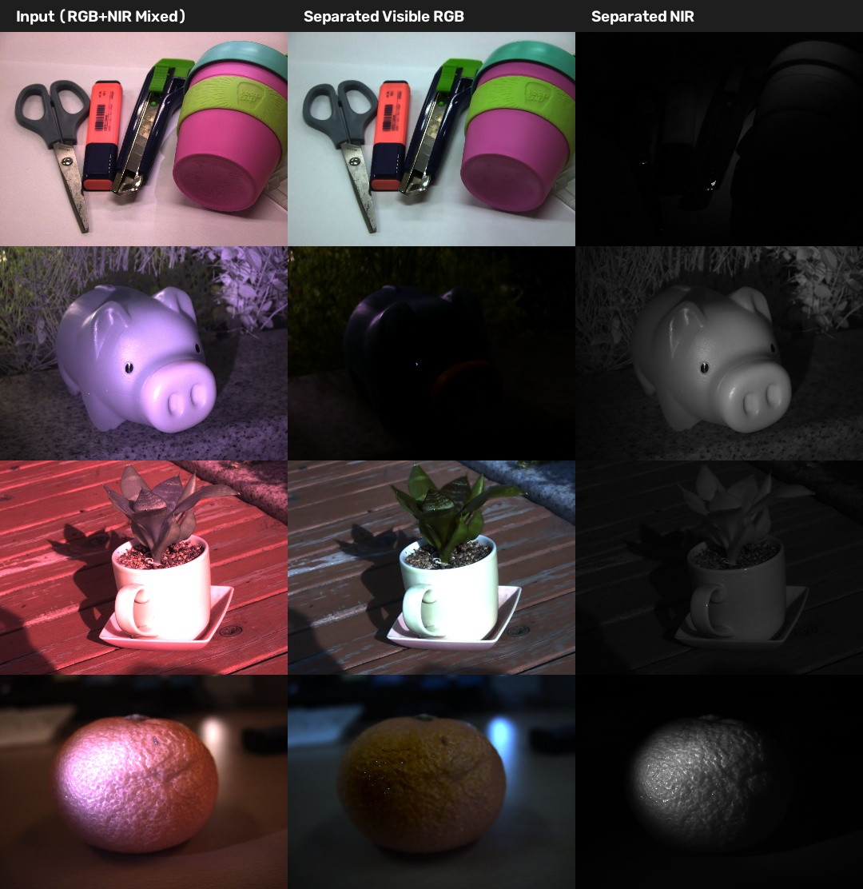
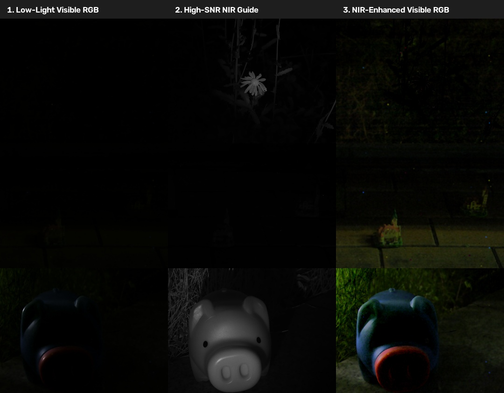
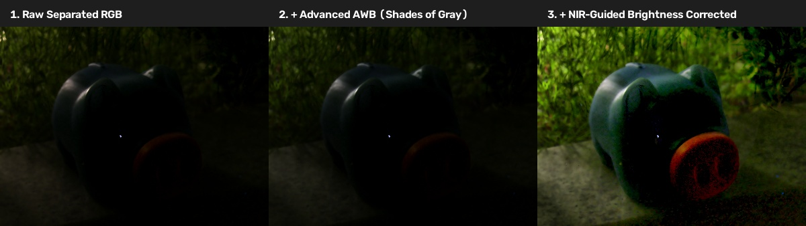

# An Acquisition Method for Visible and Near Infrared Images from Single CMYG Color Filter Array-Based Sensor

Official implementation (Python & MATLAB) of the paper:
**"An Acquisition Method for Visible and Near Infrared Images from Single CMYG Color Filter Array-Based Sensor"**  
*Sensors* 2020, 20(19), 5578; DOI: [10.3390/s20195578](https://doi.org/10.3390/s20195578)  
**Authors**: Younghyeon Park and Byeungwoo Jeon (*Digital Media Lab, Sungkyunkwan University*)

---

<p align="center">
  
</p>

---

## 📌 Overview

This repository provides a method to acquire and separate **Visible (RGB)** and **Near-Infrared (NIR)** images simultaneously from a single image sensor equipped with a **CMYG (Cyan, Magenta, Yellow, Green)** Color Filter Array (CFA) without an IR cut filter (hot-mirror).

```
[CMYG RAW Sensor Data] 
       │
       ▼ (1. Demosaicing)
[Interpolated C', M', Y', G' Channels] 
       │
       ▼ (2. Matrix Inverse Transformation)
[Raw Separated RGB & NIR] 
       │
       ▼ (3. Guided Denoising)
[Denoised RGB & NIR Images] 
       │
       ▼ (4. Auto White Balance)
[Final High-Quality Visible RGB + NIR]
```

### Key Advantages
- **High Sensitivity**: Complementary CMYG filters pass more light and NIR spectrum than traditional RGB filters.
- **Fast & Lightweight**: Matrix inversion signal transformation and Joint Guided Filtering allow real-time execution.
- **High Reconstruction Quality**: Minimal color artifact and superior PSNR compared to traditional compressive sensing (SL0) methods.

---

## 📷 Qualitative Visual Results

Below are representative separation results produced across multiple indoor and outdoor real-world scenes (*Objects, Piggybank, Sunlight Plants, Fruits*):

<p align="center">
  
</p>

---

## 📁 Repository Structure

```text
.
├── README.md                  # Project documentation & paper details
├── LICENSE                    # MIT License
├── requirements.txt           # Top-level Python dependencies
├── .gitignore                 # Output/temporary file filters
├── docs/                      # Teaser overview images & visual gallery
│   ├── overview.jpg
│   ├── results_gallery.jpg
│   ├── brightness_wb_experiment.jpg
│   └── lowlight_enhancement_experiment.jpg
│
├── python/                    # Python Implementation
│   ├── cmyg_separation/       # Modular Python Package
│   │   ├── __init__.py
│   │   ├── demosaic.py        # 2x2 CMYG Bayer pattern demosaicing
│   │   ├── separation.py      # Matrix inverse RGB & NIR signal separation
│   │   ├── denoising.py       # Guided Filter & Wiener filter
│   │   ├── metrics.py         # PSNR, MSE, EVCC metrics
│   │   ├── epfl_separation.py # EPFL baseline separation (SL0)
│   │   └── lowlight_enhancement.py # NIR-assisted low-light enhancement
│   ├── demo.py                # Standalone Python demo script
│   ├── run_evaluation.py      # SKKU vs EPFL benchmark script
│   ├── run_hyperspectral_sim.py # Spectral sensitivity simulation
│   ├── run_lowlight_enhancement.py # Low-light enhancement demo
│   ├── run_brightness_wb_experiment.py # Brightness & AWB correction experiment
│   └── requirements.txt       # Package requirements
│
└── matlab/                    # Complete MATLAB Implementation
    ├── main_separation.m      # Main MATLAB demo script
    ├── core/                  # Core functions (demosaic, separation, denoising, AWB)
    ├── evaluation/            # EPFL comparison benchmarks & PSNR metrics
    ├── hyperspectral_sim/     # Spectral sensitivity function (SSF) simulation
    ├── lowlight_enhancement/  # NIR-guided low-light enhancement application
    └── video_coding/          # HEVC / HM codec compression test configs
```

---

## 🚀 Quick Start

### 🐍 Python Installation & Usage

1. **Install dependencies**:
   ```bash
   pip install -r requirements.txt
   ```

2. **Run Python Demos & Experiments**:
   ```bash
   cd python
   python demo.py
   python run_lowlight_enhancement.py
   python run_brightness_wb_experiment.py
   ```

3. **Python Code Example**:
   ```python
   import cv2
   from cmyg_separation import process_cmyg_image, enhance_lowlight_image

   # 1. Load Raw 12-bit CMYG PGM/RAW image
   raw_cmyg = cv2.imread("samples/sample_cmyg.pgm", cv2.IMREAD_UNCHANGED)

   # 2. Process through pipeline
   rgb_img, nir_img, mixed_img = process_cmyg_image(raw_cmyg, max_val=4095.0, denoise_method='guided')

   # 3. Enhance low-light visible RGB using high-SNR NIR guidance
   enhanced_rgb = enhance_lowlight_image(rgb_img, nir_img)
   ```

---

### 🔬 MATLAB Usage

1. Open MATLAB and set the working directory to `matlab/`.
2. Run the main script:
   ```matlab
   main_separation
   ```

---

## 💡 Experimental Modules & Extensions

### 1. NIR-Assisted Low-Light Image Enhancement
In extremely dark environments where visible RGB signals have low SNR, the NIR spectrum provides high-SNR structural details. This module fuses the separated NIR luminance & high-frequency detail into the visible RGB image:

<p align="center">
  
</p>

### 2. Visible Brightness & Advanced White Balance Correction
Separated visible RGB images can suffer from low exposure and color cast under complex illuminations. We include an advanced enhancement module:
- **Advanced Auto White Balance**: Minkowski $p$-norm based **`Shades of Gray` ($p=6$)** and **`Max-RGB`** algorithms.
- **Chromaticity-Preserving NIR-Guided Brightness Correction**: Preserves natural chromaticity ratios ($R/I, G/I, B/I$) while adaptively boosting under-exposed dark regions guided by NIR signal:
  $$V_{guided} = V^{\gamma} \cdot \left(1 + \lambda \cdot \text{max}(0, N - V)\right)$$

<p align="center">
  
</p>

---

## 📜 Citation & Related Patents

If you find this work or code useful for your research or applications, please cite our paper and patent:

### Academic Paper
```bibtex
@article{park2020acquisition,
  title={An Acquisition Method for Visible and Near Infrared Images from Single CMYG Color Filter Array-Based Sensor},
  author={Park, Younghyeon and Jeon, Byeungwoo},
  journal={Sensors},
  volume={20},
  number={19},
  pages={5578},
  year={2020},
  publisher={MDPI},
  doi={10.3390/s20195578}
}
```

### Related US Patent
- **U.S. Patent No. 10,027,933 B2**: *"Method and apparatus for outputting images"*
  - **Inventors**: Kwanghyun Won, Changyoon Kim, Byeungwoo Jeon, Khanh Quoc Dinh, Hyunjong Shim, Seunghwan Lee
  - **Assignee**: Samsung Electronics Co., Ltd.
  - **Grant Date**: July 17, 2018
  - **Patent Link**: [US10027933B2 (Google Patents)](https://patents.google.com/patent/US10027933B2/en)

---

## 📄 License

This project is licensed under the [MIT License](LICENSE).
